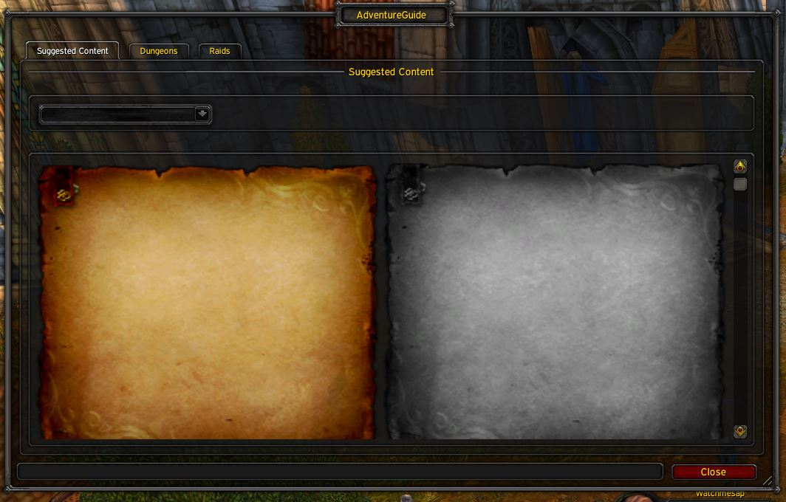
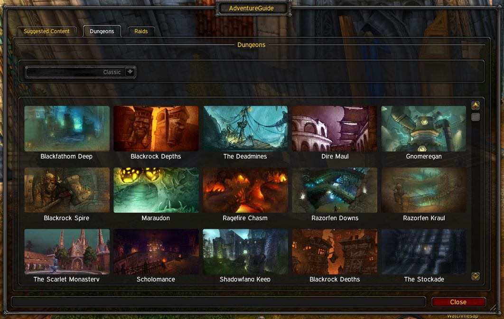
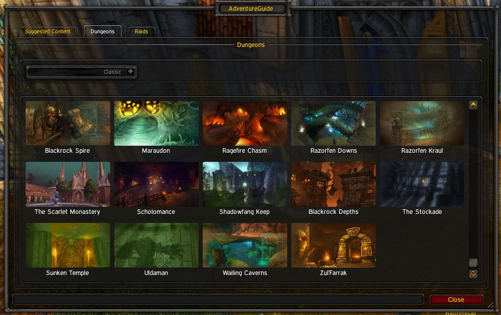

# AdventureGuide
Attempting to create an Adventure Guide for Classic Era

## --ADDON STILL IN DEVELOPMENT -- 
Screenshots below are pre-alpha - If you would benefit from having an addon like this you are able to contribute.

# What does this addon do?
The purpose of this addon is to aid both new and veteran players of World of Warcraft Classic, particularly with the rise of the Hardcore community who may enter dungeons or raids without knowledge of the boss's abilities or potential loot drops. 

It can also be beneficial for players with multi life characters, as they can familiarize themselves with encounters and potential loot upgrades for future adventures. In addition, suggested content is included to recommend leveling zones that are appropriate for the player's level.

# FAQ

# Screenshots

<!-- 
 -->